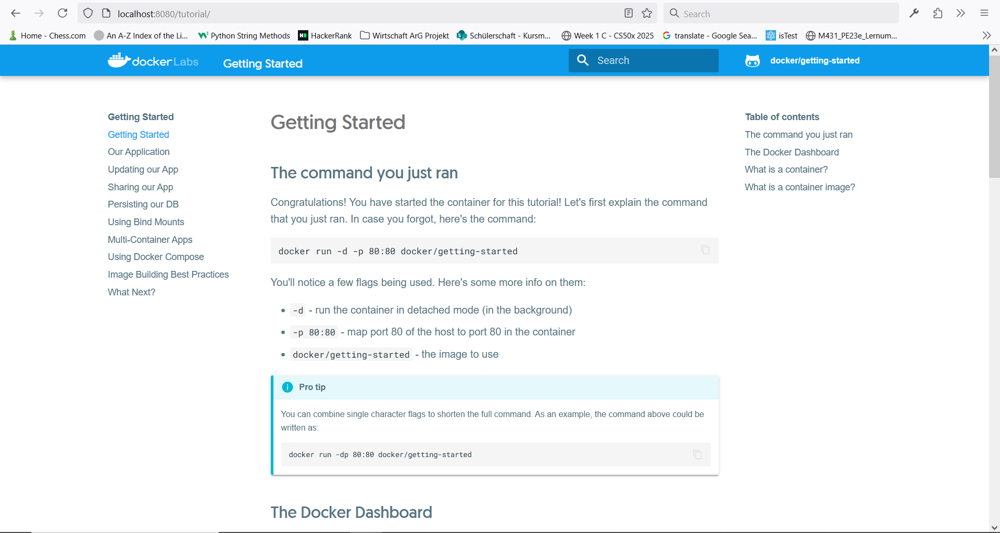
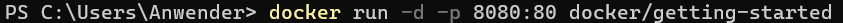
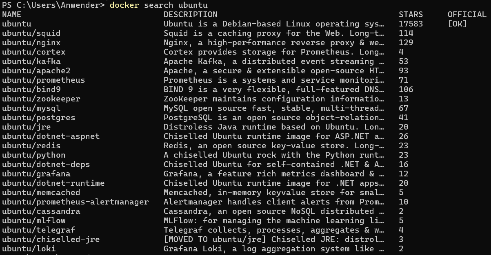
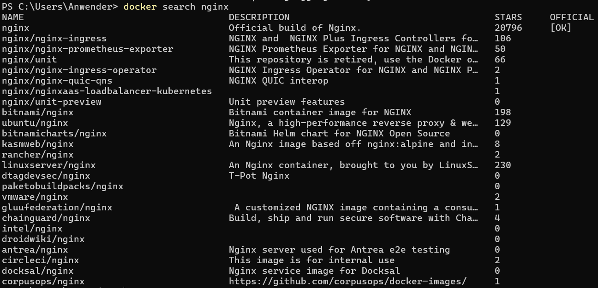
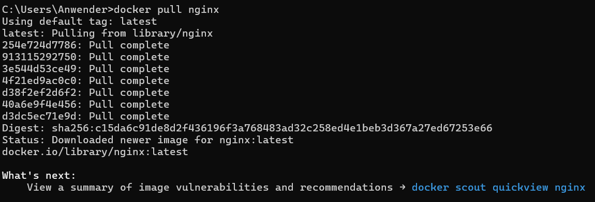
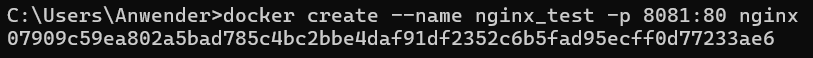
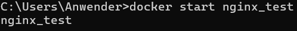
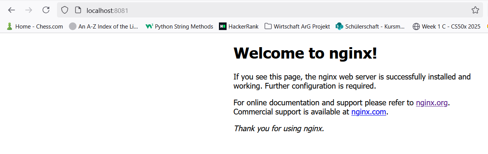

# KN01

## A)

## B)

Benutzte docker version:  
Docker version 27.4.0, build bde2b89

Befehl:

`docker` - docker anrufen  
`run` - docker container ausfuhren  
`-d` - detached (discrete) doesn't output to terminal  
`-p` - port forwarding  
`8080:80` - container port `80` gets forwarded to local port `8080`  
`docker/getting-started` - getting-started image from docker  

### Zeigen dass docker run gleich wie docker pull, create, start ist

