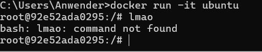

# KN01

## A)

## B)

Benutzte docker version:  
Docker version 27.4.0, build bde2b89

Befehl:

`docker` - docker anrufen  
`run` - docker container ausfuhren  
`-d` - detached (discrete) doesn't output to terminal  
`-p` - port forwarding  
`8080:80` - container port `80` gets forwarded to local port `8080`  
`docker/getting-started` - getting-started image from docker  

### Zeigen dass docker run gleich wie docker pull, create, start ist

### Docker run optionen

`-d` bedeutet "detached", also im Hintergrund ausführen  
`ubuntu` ist das Image

Nach dem Befehl `docker run -d ubuntu` wurde das Ubuntu-Image automatisch heruntergeladen. Docker hat den Container im Hintergrund gestartet, ihn jedoch sofort wieder gestoppt, weil kein Befehl zum dauerhaften Ausführen übergeben wurde.

`-i` steht für „interaktiv“  
`-t` für „Pseudo-TTY“  
`ubuntu` ist das Image

Mit dem Befehl `docker run -it ubuntu` wurde der Container im interaktiven Modus gestartet. Ich befinde mich jetzt in einer Ubuntu-Shell und kann Befehle wie ls, pwd oder apt update ausführen. Der Container läuft solange, bis ich ihn mit exit verlasse. Das Image wurde bei Bedarf automatisch heruntergeladen.

### Nginx interactive shell while running

### Stopping and removing

## C)

## D)

Dieser Befehl erstellt ein neuen LOCALEN tag von dem nginx image  
Der tag ist wie den name vom image im repo  

`docker push` pushed den lokalen tag auf dem repo auf docker server  

